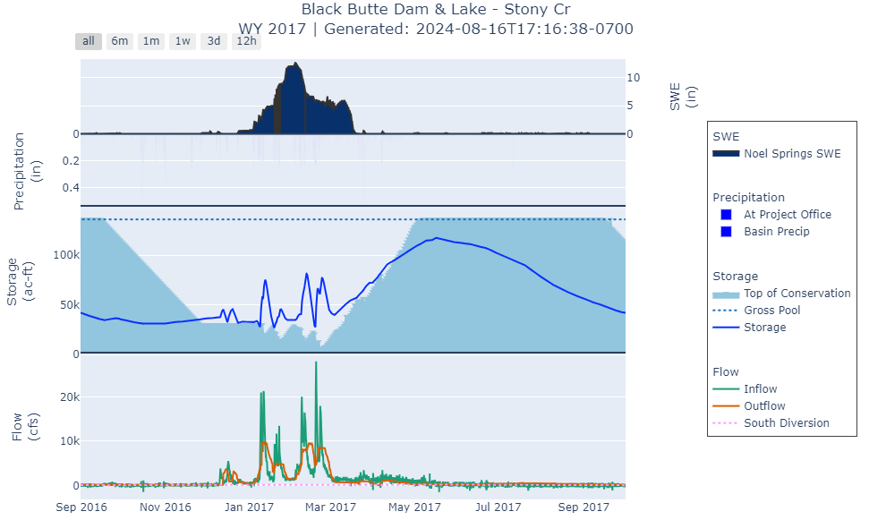

# TethysDash USACE Plugin

This repository contains custom [intake](https://intake.readthedocs.io/en/latest/making-plugins.html) drivers that are used in the [tethys dashboard app](https://git.aquaveo.com/tethys/firo/tethysdash) for creating custom visualizations.

Refer to [this documentation](https://git.aquaveo.com/tethys/firo/tethysdash/-/blob/plugins/README.md?ref_type=heads#visualization-plugins) for more information on how to develop new dashboard plugins.

# Available Visualizations

## Time Series

Type: plotly

Description: A water year based plot that shows reservoir statistics for precip, storage, and flow. Values are derived from https://www.spk-wc.usace.army.mil/plots/california.html

